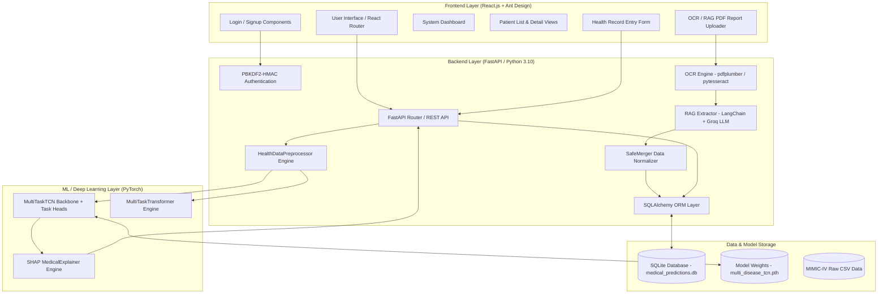
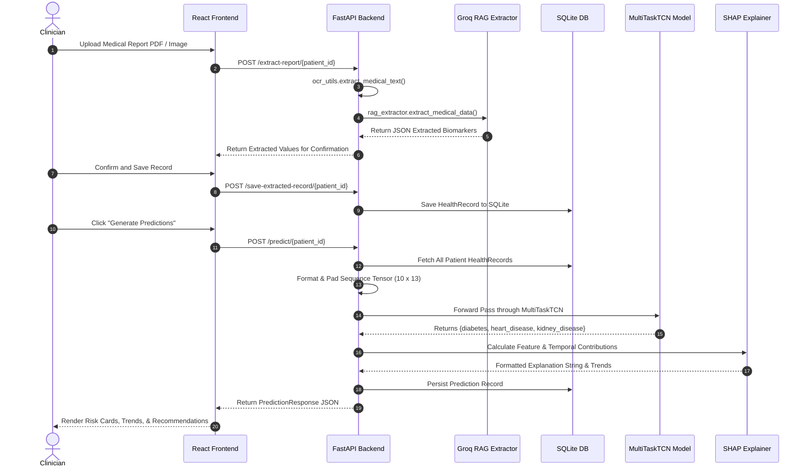
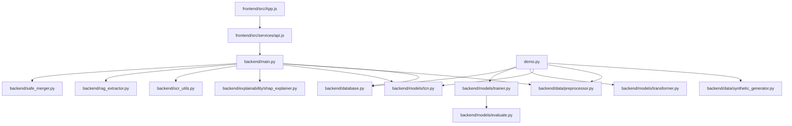

# Multi-Disease Temporal Risk Prediction System
## Complete Senior Architect & Technical Developer Documentation Manual

---

## 1. Project Overview

### Problem Statement
Chronic health conditions—specifically **Diabetes**, **Heart Disease (Cardiovascular)**, and **Kidney Disease (Chronic Kidney Disease / CKD)**—are leading causes of global morbidity. Traditional medical risk evaluation models assess static snapshots of single clinical visits. However, human health is dynamic and continuous. A single lab measurement (e.g., blood glucose of 110 mg/dL) might appear safe in isolation, but when viewed as part of a rising trajectory over 12 months (90 → 100 → 110 mg/dL), it signals an impending metabolic breakdown. 

Existing clinical prediction systems suffer from three core limitations:
1. **Snapshot Bias**: Ignoring temporal trajectories, velocity, and longitudinal trends across multiple past visits.
2. **Single-Disease Silos**: Models predict isolated conditions, ignoring shared physiological pathways (e.g., diabetic nephropathy connecting diabetes and kidney failure).
3. **Black-Box Opacity**: Deep neural networks fail to provide clinical explainability required for physician trust and decision-support.

### System Purpose
The **Multi-Disease Temporal Risk Prediction System** addresses these limitations by providing an end-to-end AI platform that ingests longitudinal patient health records, models irregular time-series intervals, jointly predicts 3-year risk probabilities for Diabetes, Heart Disease, and Kidney Disease using multi-task deep neural architectures (**Temporal Convolutional Networks** and **Time-Series Transformers**), extracts lab values from unstructured medical PDF reports via Retrieval-Augmented Generation (RAG) and OCR, and renders physician-centric SHAP explainability insights.

### Target Users
- **Primary Clinicians & General Practitioners**: To identify high-risk patients early during routine check-ups.
- **Medical Specialists (Cardiologists, Endocrinologists, Nephrologists)**: For joint multi-organ risk tracking.
- **Clinical Data Engineers & Researchers**: For testing temporal deep learning architectures on EHR datasets (MIMIC-IV / Synthetic).

### Real-World Use Case
A patient with hypertension and pre-diabetes visits a clinic over a 2-year span. Their electronic health records (EHR) or uploaded lab report PDFs are ingested by the system. The FastAPI backend extracts 11 biometric parameters, constructs a temporal sequence tensor, and passes it to the `MultiTaskTCN` model. The system predicts elevated 3-year risks across all three organ systems, highlights the specific deteriorating features (e.g., rising Serum Creatinine and HbA1c), and generates actionable clinical warnings for immediate physician intervention.

### Expected Outputs
1. **Multi-Task Risk Scores**: Probabilities ($0.0$ to $1.0$) for Diabetes, Heart Disease, and Kidney Disease.
2. **Risk Categorization**: Low ($< 30\%$), Moderate ($30\% - 70\%$), High ($> 70\%$).
3. **Temporal Trend Summaries**: Longitudinal delta tracking (e.g., $120 \rightarrow 145$ mmHg Systolic BP).
4. **SHAP Feature & Timeline Explanations**: Identification of top risk-driving biomarkers and key predictive clinical visits.
5. **RAG-Extracted Health Records**: Automated JSON field extraction from uploaded diagnostic PDF/Image reports.

---

## 2. Project Architecture

### High-Level System Architecture



### End-to-End Data & Inference Flow



### Component Breakdown
1. **Frontend**: Built with React 18, React Router v6, Axios, and Ant Design (antd v5). Handles multi-page routing, state management via `sessionStorage`, patient search/filter, interactive trend charts, and PDF report uploads.
2. **Backend**: Built with FastAPI, Uvicorn, and SQLAlchemy. Provides REST endpoints for user authentication, patient CRUD, record merging, RAG text parsing, model inference, and prediction history.
3. **Data Pipeline**: `HealthDataPreprocessor` handles forward/backward missing value imputation, median fallback, time-gap calculation (`days_since_first`, `days_since_last`), sequence scaling via `StandardScaler`, and zero-padding to a canonical sequence length of 10.
4. **Machine Learning Engine**: Dual architecture containing a 3-layer Dilated Temporal Convolutional Network (`MultiTaskTCN`) with causal convolutions and a Multi-Head Self-Attention Transformer (`MultiTaskTransformer`).
5. **Explainability Layer**: Uses Tree/Kernel SHAP (`MedicalExplainer`) to compute local feature attribution values across both space (biomarkers) and time (historical visit indices).
6. **OCR & RAG Subsystem**: Combines `pdfplumber` (native PDF text parsing), `pytesseract` (Tesseract OCR for scanned images), and LangChain with Groq (`llama-3.3-70b-versatile` / `llama3-70b-8192`) for structured JSON extraction.

---

## 3. Tech Stack

| Category | Technology | Version | Justification / Architectural Rationale |
| :--- | :--- | :--- | :--- |
| **Programming Languages** | Python | `3.10.x` | Primary backend, data engineering, and PyTorch deep learning execution. |
| | JavaScript (ES6+) | Modern | Frontend UI development with React ecosystem. |
| **Web Framework (Backend)**| FastAPI | `^0.104.1` | High-performance asynchronous REST API framework with native Pydantic typing and automatic OpenAPI spec generation. |
| **ASGI Server** | Uvicorn | `^0.24.0` | Production-grade ASGI server for running FastAPI asynchronously. |
| **Database & ORM** | SQLite / SQLAlchemy | `^2.0.23` | Lightweight relational persistence layer requiring zero background process administration, fully mapping Patients, Records, Predictions, and Users. |
| **Deep Learning** | PyTorch | `^2.1.1` | Tensor computational framework used to construct dynamic computational graphs for TCN and Transformer models. |
| **Machine Learning & Stats**| Scikit-learn | `^1.3.2` | Data scaling (`StandardScaler`), evaluation metrics (ROC-AUC, Precision, Recall, F1), and train-test splitting. |
| | NumPy & Pandas | `^1.26.2` / `^2.1.3` | Matrix operations, sequence manipulation, missing value imputation, and tabular dataset processing. |
| **Explainability (XAI)** | SHAP | `^0.43.0` | Game-theoretic SHAP (SHapley Additive exPlanations) values for medical feature and visit attributions. |
| **RAG & LLM Integration** | LangChain & LangChain-Groq | `^0.0.1` | LLM orchestration framework to query Groq's high-speed inference cloud. |
| | Groq API (`llama-3.3-70b`) | Cloud API | Ultra-fast LLM inference engine executing structured zero-shot JSON extraction from noisy medical report text. |
| **Document Processing / OCR**| pdfplumber | `^0.10.3` | Native digital PDF text and tabular data extraction. |
| | PyTesseract & PIL | `^0.3.10` | Optical Character Recognition engine binding for scanned medical image reports (JPG, PNG). |
| **Frontend Framework** | React | `^18.2.0` | Component-driven declarative UI library for rendering dynamic clinical dashboards. |
| **UI Component Library** | Ant Design (antd) | `^5.11.5` | Enterprise-grade React UI component system (tables, statistics, cards, notifications). |
| **Data Visualization** | Matplotlib & Seaborn | `^3.8.2` / `^0.13.0` | Backend generation of ROC curves, PR curves, and training history metric artifacts. |

---

## 4. Folder Structure

```
Multi Disease Prediction/
├── .claude/                             # Agent configuration metadata
│   ├── settings.json
│   └── settings.local.json
├── .git/                                # Git version control repository
├── .gitignore                           # Git exclusion rules
├── ARCHITECTURE.md                      # Architecture reference documentation
├── README.md                            # Repository overview README
├── RENDER_DEPLOYMENT.md                 # Cloud deployment instructions for Render
├── SETUP_GUIDE.md                       # Environment setup & installation guide
├── VIVA_ANSWERS_PART1.md                # Viva defense reference (Part 1)
├── VIVA_ANSWERS_PART2.md                # Viva defense reference (Part 2)
├── VIVA_ANSWERS_PART3.md                # Viva defense reference (Part 3)
├── demo.py                              # Master demonstration script
├── requirements.txt                     # Root environment dependencies
├── test_prediction.py                   # Standalone CLI model testing script
├── backend/                             # Python Backend Application Core
│   ├── .env                             # Environment configuration (GROQ_API_KEY, PORT)
│   ├── database.py                      # SQLAlchemy models & database connection
│   ├── main.py                          # FastAPI application, routes, & inference engine
│   ├── medical_predictions.db           # SQLite database storage file
│   ├── migrate_db.py                    # Database schema migration utility
│   ├── multi_disease_tcn.pth            # Pretrained PyTorch model checkpoint weights
│   ├── ocr_utils.py                     # PDF and Image OCR extraction library
│   ├── rag_extractor.py                 # LangChain + Groq RAG medical report parser
│   ├── requirements.txt                 # Backend-specific Python dependencies
│   ├── safe_merger.py                   # Health record merging and validation module
│   ├── setup_rag.py                     # Groq RAG verification script
│   ├── simple_rag.py                    # Direct HTTP Groq API fallback extractor
│   ├── training_history.png             # TCN training convergence plot artifact
│   ├── data/                            # Data Engineering Subsystem
│   │   ├── preprocessor.py              # Sequence builder, scaler, and PyTorch dataset
│   │   ├── synthetic_generator.py       # Longitudinal synthetic health data generator
│   │   └── raw/                         # Raw MIMIC-IV Clinical CSV Data
│   │       ├── admissions.csv           # Clinical admission records
│   │       ├── d_icd_diagnoses.csv      # ICD-9/10 diagnosis code dictionary
│   │       ├── d_labitems.csv           # Laboratory item dictionary
│   │       ├── diagnoses_icd.csv        # Patient diagnosis assignments
│   │       ├── labevents.csv            # Patient lab measurement events
│   │       └── patients.csv             # Patient demographic attributes
│   ├── explainability/                  # Model Explainability Subsystem
│   │   └── shap_explainer.py            # SHAP explainer for medical feature attribution
│   ├── models/                          # Deep Learning Neural Architecture Definitions
│   │   ├── evaluate.py                  # Evaluation metrics script (AUC, PR, Confusion)
│   │   ├── tcn.py                       # MultiTaskTCN architecture definition
│   │   ├── test_model.py                # Unit test for PyTorch model tensor shapes
│   │   ├── trainer.py                   # MultiTaskLoss trainer with early stopping
│   │   └── transformer.py               # MultiTaskTransformer architecture definition
│   └── outputs/                         # Model Performance Plot Output Artifacts
│       ├── diabetes_metrics.png
│       ├── diabetes_pr_curve.png
│       ├── diabetes_roc_curve.png
│       ├── heart_disease_metrics.png
│       ├── heart_disease_pr_curve.png
│       ├── heart_disease_roc_curve.png
│       ├── kidney_disease_metrics.png
│       ├── kidney_disease_pr_curve.png
│       └── kidney_disease_roc_curve.png
└── frontend/                            # React Frontend Web Application
    ├── package.json                     # Frontend Node dependencies & scripts
    ├── package-lock.json                # Dependency lockfile
    ├── public/                          # Static public assets
    │   └── index.html                   # HTML template root entry
    └── src/                             # React Source Code
        ├── App.css                      # Global layout styles
        ├── App.js                       # Root App component, routing, & auth state
        ├── index.js                     # React DOM rendering entry point
        ├── components/                  # Shared UI components (Currently empty)
        ├── pages/                       # Application Views / Pages
        │   ├── AddHealthRecord.js       # Manual lab value input form
        │   ├── Dashboard.js             # Overview dashboard & system status
        │   ├── Login.js                 # User login authentication page
        │   ├── PatientDetail.js         # Patient health timeline & prediction report
        │   ├── PatientList.js           # Patient listing & registry management
        │   ├── Signup.js                # New user registration page
        │   └── UploadReport.js          # Medical report PDF file upload page
        └── services/                    # API Service Layer
            └── api.js                   # Axios HTTP client & endpoint interfaces
```

### Detailed File Responsibilities

#### `backend/main.py`
- **Purpose**: Main FastAPI web server, authentication controller, and prediction dispatcher.
- **Responsibilities**: Initializes DB tables, loads PyTorch `MultiTaskTCN` model checkpoint into memory, handles CORS middleware, manages patient CRUD, extracts report data via OCR/RAG, generates disease risk scores with temporal trend rules, computes SHAP explanations, and runs the Uvicorn server.
- **Dependencies**: `fastapi`, `sqlalchemy`, `torch`, `database.py`, `models.tcn`, `data.preprocessor`, `ocr_utils`, `rag_extractor`.
- **Execution**: Run directly via `python backend/main.py` or via Uvicorn (`uvicorn main:app --reload`).

#### `backend/database.py`
- **Purpose**: Relational database schema definitions and connection pooling.
- **Responsibilities**: Defines SQLAlchemy ORM entities (`User`, `Patient`, `HealthRecord`, `Prediction`), handles SQLite connection pooling (`medical_predictions.db`), and executes dynamic schema migrations (e.g., auto-adding `user_id` foreign key).
- **Dependencies**: `sqlalchemy`.

#### `backend/models/tcn.py`
- **Purpose**: Temporal Convolutional Network neural architecture implementation.
- **Responsibilities**: Implements 1D Causal Convolutions (`CausalConv1d`), Residual Blocks with exponentially increasing dilations ($d = 1, 2, 4$), Shared Dense Layers, and 3 Multi-Task Sigmoid Output Heads (`diabetes`, `heart_disease`, `kidney_disease`).
- **Dependencies**: `torch`, `torch.nn`.

#### `backend/models/transformer.py`
- **Purpose**: Time-Series Transformer neural architecture implementation.
- **Responsibilities**: Implements `PositionalEncoding`, `TimeGapEncoding` (log-transformed visit gap embeddings), `MultiHeadAttention`, Transformer Encoder blocks, Attention Pooling, and Multi-Task Prediction Heads.
- **Dependencies**: `torch`, `torch.nn`, `math`.

#### `backend/models/trainer.py`
- **Purpose**: Supervised training and validation loop.
- **Responsibilities**: Implements multi-task binary cross-entropy loss (`MultiTaskLoss`), Adam optimizer, learning rate decay (`ReduceLROnPlateau`), early stopping based on validation loss, evaluation metrics (ROC-AUC), and visual plot saving.
- **Dependencies**: `torch`, `sklearn.metrics`, `matplotlib`.

#### `backend/data/preprocessor.py`
- **Purpose**: Data preprocessing and temporal sequence builder.
- **Responsibilities**: Handles missing value forward-fill/backward-fill/median imputation, calculates time features (`days_since_first`, `days_since_last`), scales features via `StandardScaler`, pads sequences to fixed length (10), and wraps sequences in PyTorch `HealthDataset`.
- **Dependencies**: `numpy`, `pandas`, `sklearn.preprocessing`, `torch`.

#### `backend/data/synthetic_generator.py`
- **Purpose**: Realistic longitudinal EHR synthetic data generator.
- **Responsibilities**: Generates synthetic patient demographic profiles, realistic clinical baseline lab values, simulates multi-month disease progression trends with noise, missing values, and creates binary ground-truth disease labels.
- **Dependencies**: `numpy`, `pandas`, `random`, `datetime`.

#### `backend/explainability/shap_explainer.py`
- **Purpose**: Explainable AI engine.
- **Responsibilities**: Constructs SHAP Explainers, evaluates local feature importance across 13 clinical features and 10 temporal visit slots, generates human-readable medical explanation strings for doctors.
- **Dependencies**: `shap`, `torch`, `numpy`, `matplotlib`, `seaborn`.

#### `backend/rag_extractor.py` & `backend/ocr_utils.py`
- **Purpose**: Medical PDF text extraction and RAG parsing engine.
- **Responsibilities**: `ocr_utils.py` uses `pdfplumber` for native PDFs and `pytesseract` for scanned images. `rag_extractor.py` sends extracted text to Groq API (`llama-3.3-70b-versatile`) via LangChain to produce structured JSON lab values.
- **Dependencies**: `pdfplumber`, `pytesseract`, `PIL`, `langchain_groq`.

#### `frontend/src/App.js` & `frontend/src/services/api.js`
- **Purpose**: Single Page Application root controller and API service interface.
- **Responsibilities**: `App.js` manages authentication session state (`sessionStorage`), menu navigation, layout header, and route rendering. `api.js` configures Axios client with request interceptors attaching `X-User-Id` headers and exposes functions for all backend endpoints.
- **Dependencies**: `react`, `react-router-dom`, `antd`, `axios`.

---

## 5. Environment Setup

### Prerequisites & Versions
- **Operating System**: Windows 10/11, Ubuntu 20.04/22.04 LTS, or macOS (Intel/Apple Silicon).
- **Python**: `3.10.x` (Recommended: `3.10.11`).
- **Node.js**: `v18.x` or `v20.x` LTS.
- **npm**: `v9.x` or `v10.x`.
- **CUDA / GPU**: Optional. System automatically selects NVIDIA CUDA GPU if available (`cuda:0`), otherwise defaults to CPU execution.
- **RAM Recommendation**: Minimum 8 GB (16 GB recommended for running PyTorch and frontend dev server simultaneously).
- **Disk Space**: ~2 GB (includes Node modules, Python venv, raw datasets, and PyTorch weights).
- **System Dependencies (OCR)**: Tesseract OCR binary (required only if processing scanned image medical reports).

### Python Virtual Environment Setup
Using standard `venv`:
```bash
python -m venv venv
# On Windows (PowerShell):
.\venv\Scripts\Activate.ps1
# On Linux/macOS:
source venv/bin/activate
```

Using Conda:
```bash
conda create -n multidisease python=3.10 -y
conda activate multidisease
```

### VS Code Recommended Extensions
- Python (`ms-python.python`)
- Pylance (`ms-python.vscode-pylance`)
- ES7+ React/Redux/React-Native snippets (`dsznajder.es7-react-js-snippets`)
- Markdown All in One (`yzhang.markdown-all-in-one`)

---

## 6. Installation Guide

### Step-by-Step Installation

#### 1. Clone the Repository
```bash
git clone https://github.com/charan-teja-2714/Multi-Disease-Temporal-Risk-Prediction-System.git
cd "Multi Disease Prediction"
```

#### 2. Configure Backend Environment
Navigate to backend directory and create virtual environment:
```bash
cd backend
python -m venv venv
.\venv\Scripts\Activate.ps1
```

Install backend dependencies:
```bash
pip install --upgrade pip
pip install -r requirements.txt
```

Create environment file (`backend/.env`):
```ini
GROQ_API_KEY=your_groq_api_key_here
PORT=8000
```
*(Note: A Groq API key can be obtained for free from https://console.groq.com. If omitted, the system falls back to regex-based report extraction).*

#### 3. Configure Frontend Environment
In a separate terminal, navigate to the frontend directory:
```bash
cd frontend
npm install
```

#### 4. Optional OCR Engine Installation (for Image PDF OCR)
- **Windows**: Download Tesseract OCR installer from UB-Mannheim (`tesseract-ocr-w64-setup.exe`). Install to `C:\Program Files\Tesseract-OCR` and add to system `PATH`.
- **Linux (Ubuntu)**: `sudo apt-get update && sudo apt-get install -y tesseract-ocr`

### Common Installation Issues & Solutions

1. **`pdfplumber` / `pytesseract` Import Failure**:
   - *Symptom*: Warning logged on startup: `pdfplumber not available - PDF processing disabled`.
   - *Fix*: Re-run `pip install pdfplumber pytesseract Pillow` inside the active Python environment.

2. **PyTorch Installation Mismatch (CPU vs GPU)**:
   - *Symptom*: `torch.cuda.is_available()` returns `False` on GPU machines.
   - *Fix*: Install CUDA-specific PyTorch build:
     `pip install torch --index-url https://download.pytorch.org/whl/cu118`

3. **Frontend CORS Block / API Connection Error**:
   - *Symptom*: Dashboard displays `Failed to load dashboard data`.
   - *Fix*: Ensure FastAPI backend is running on `http://localhost:8000` and `backend/main.py` has CORS origins configured (`allow_origins=["*"]`).

---

## 7. Dataset Documentation

The system supports two data modes:
1. **Synthetic Longitudinal Dataset Generator** (`backend/data/synthetic_generator.py`)
2. **MIMIC-IV EHR Clinical Subset** (`backend/data/raw/`)

### Synthetic Health Dataset
- **Generator**: `SyntheticHealthDataGenerator`
- **Location**: Generated in-memory or exported to CSV via `demo.py`.
- **Samples**: Default 500 to 1,000 patients, generating 2,500 to 6,000 temporal health visits.
- **Attributes per Patient Profile**: `age` (30–80), `gender` ('M'/'F'), baseline risk probabilities.
- **Features Tracked (11 Lab Measurements)**:
  1. `glucose`: Fasting Blood Glucose (mg/dL) [Normal range: 70–100]
  2. `hba1c`: Glycated Hemoglobin (%) [Normal range: 4.0–5.6]
  3. `creatinine`: Serum Creatinine (mg/dL) [Normal range: 0.6–1.2]
  4. `bun`: Blood Urea Nitrogen (mg/dL) [Normal range: 7–20]
  5. `systolic_bp`: Systolic Blood Pressure (mmHg) [Normal range: 90–120]
  6. `diastolic_bp`: Diastolic Blood Pressure (mmHg) [Normal range: 60–80]
  7. `cholesterol`: Total Cholesterol (mg/dL) [Normal range: 125–200]
  8. `hdl`: High-Density Lipoprotein (mg/dL) [Normal range: 40–60]
  9. `ldl`: Low-Density Lipoprotein (mg/dL) [Normal range: 100–130]
  10. `triglycerides`: Serum Triglycerides (mg/dL) [Normal range: 50–150]
  11. `bmi`: Body Mass Index (kg/m²) [Normal range: 18.5–24.9]
- **Target Labels**: Binary multi-label targets (`diabetes_label`, `heart_disease_label`, `kidney_disease_label`) derived from clinical diagnostic cutoffs ($126$ mg/dL glucose, $6.5\%$ HbA1c, $140$ mmHg SBP, $1.5$ mg/dL Creatinine).
- **Missingness**: Simulated $10\%$ random missingness across lab visits.

### MIMIC-IV Clinical Subset Data Files (`backend/data/raw/`)
Located in `backend/data/raw/`:
- `patients.csv` (3.6 KB, 100 rows): Demographics (`subject_id`, `gender`, `anchor_age`).
- `admissions.csv` (47.4 KB, 129 rows): Hospital admissions (`hadm_id`, `admittime`, `dischtime`).
- `diagnoses_icd.csv` (128.6 KB, 4,756 rows): ICD-9/10 diagnoses mapping (`subject_id`, `icd_code`).
- `d_icd_diagnoses.csv` (8.85 MB, 109,775 rows): ICD diagnosis lookup dictionary.
- `labevents.csv` (12.27 MB, 222,540 rows): Time-stamped laboratory measurements (`valuenum`, `itemid`).
- `d_labitems.csv` (63.6 KB, 1,623 rows): Lab item master metadata.

---

## 8. Data Pipeline

### Sequence Construction & Normalization Architecture


### Transformation Steps
1. **Missing Value Imputation**:
   - **Step 1**: Patient-level Forward Fill (`ffill()`) carries forward the most recent past lab measurement.
   - **Step 2**: Patient-level Backward Fill (`bfill()`) handles initial missing visits.
   - **Step 3**: Global Population Median Imputation fills any remaining unobserved features.
2. **Temporal Feature Injection**:
   - Computes `days_since_first`: Total days elapsed since the patient's baseline visit ($t_0$).
   - Computes `days_since_last`: Days elapsed since the immediately preceding clinical visit ($\Delta t$).
3. **Canonical Tensor Assembly**:
   - For patients with $\ge 10$ visits, the most recent 10 visits are retained.
   - For patients with $< 10$ visits, zero-padding rows are prepended to the start of the sequence.
   - Matrix Dimensions: $[ \text{Batch Size}, 10, 13 ]$ (11 lab metrics + 2 temporal features).
4. **Standardization**:
   - Fits `sklearn.preprocessing.StandardScaler` on flattened training features ($\mu=0, \sigma=1$) and transforms all sequences.

---

## 9. Model Documentation (Multi-Task Deep Learning)

### 1. MultiTaskTCN (Temporal Convolutional Network)
- **Backbone**: 3 Temporal Blocks with 1D Causal Convolutions (`CausalConv1d`).
- **Causal Padding**: Padding is set to $(K-1) \times D$ and truncated at the right boundary to strictly prevent future information leakage ($t+1 \rightarrow t$).
- **Exponential Dilation Schedule**: $d \in \{1, 2, 4\}$ with kernel size $K=3$. Receptive field calculation:
  $$\text{Receptive Field} = 1 + \sum_{i=0}^{L-1} (K_i - 1) \cdot d_i = 1 + (2 \cdot 1 + 2 \cdot 2 + 2 \cdot 4) = 15 \text{ time steps}$$
  *(Exceeds canonical sequence length of 10, ensuring full temporal history coverage).*
- **Pooling & Shared Head**: `AdaptiveAvgPool1d(1)` compresses sequence output to vector size $64$, passed through a 2-layer Dense network ($64 \rightarrow 128 \rightarrow 64$) with ReLU and Dropout ($0.2$).
- **Multi-Task Task Heads**: Three parallel Sigmoid output layers:
  - `diabetes_head`: $\text{Linear}(64 \rightarrow 32) \rightarrow \text{ReLU} \rightarrow \text{Dropout} \rightarrow \text{Linear}(32 \rightarrow 1) \rightarrow \text{Sigmoid}$
  - `heart_disease_head`: Same structure.
  - `kidney_disease_head`: Same structure.
- **Parameters**: 54,948 trainable parameters.

### 2. MultiTaskTransformer (Time-Series Transformer)
- **Embedding Layer**: Projects 12 health/time features to $d_{\text{model}} = 128$ dimensions, added to a dedicated `TimeGapEncoding` layer:
  $$\text{Embedding}(t) = \text{Linear}(\text{Health}) + \text{Linear}(\log(\Delta t + 1)) + \text{PositionalEncoding}$$
- **Transformer Encoder**: 4 stacked Transformer Encoder blocks, each with 8 Attention Heads ($d_k = 16$), Feed-Forward dimension $d_{ff} = 512$, Layer Normalization, and Dropout ($0.1$).
- **Global Attention Pooling**: Learnable soft-attention pooling module computes visit-level importance weights $\alpha_t$:
  $$\alpha_t = \text{Softmax}(\text{Linear}(H_t)), \quad Z = \sum_{t=1}^{T} \alpha_t H_t$$
- **Multi-Task Task Heads**: 3 parallel Sigmoid classification heads branching from shared representation $Z$.

### Training Hyperparameters & Loss Formulation
- **Loss Function**: Multi-Task Binary Cross-Entropy Loss (`MultiTaskLoss`):
  $$\mathcal{L}_{\text{total}} = w_{\text{diab}} \mathcal{L}_{\text{BCE}}(y_d, \hat{y}_d) + w_{\text{heart}} \mathcal{L}_{\text{BCE}}(y_h, \hat{y}_h) + w_{\text{kidney}} \mathcal{L}_{\text{BCE}}(y_k, \hat{y}_k)$$
  Where $w_{\text{diab}} = w_{\text{heart}} = w_{\text{kidney}} = 1.0$.
- **Optimizer**: Adam ($\text{lr} = 0.001$).
- **Scheduler**: `ReduceLROnPlateau` (factor=$0.5$, patience=$5$ epochs, mode='min').
- **Early Stopping**: Triggers after $10$ consecutive epochs without validation loss improvement. Best weights auto-saved to `multi_disease_tcn.pth`.

---

## 10. Database Documentation

### Entity-Relationship (ER) Diagram

```mermaid
erdiagram
    users ||--o{ patients : "manages"
    patients ||--o{ health_records : "has"
    patients ||--o{ predictions : "receives"

    users {
        int id PK
        string username UK
        string email UK
        string password_hash
        datetime created_at
    }

    patients {
        int id PK
        int user_id FK
        string name
        int age
        string gender
        datetime created_at
    }

    health_records {
        int id PK
        int patient_id FK
        datetime visit_date
        float glucose
        float hba1c
        float creatinine
        float bun
        float systolic_bp
        float diastolic_bp
        float cholesterol
        float hdl
        float ldl
        float triglycerides
        float bmi
        string source
    }

    predictions {
        int id PK
        int patient_id FK
        datetime prediction_date
        float diabetes_risk
        float heart_disease_risk
        float kidney_disease_risk
        string explanation
    }
```

### Table Definitions & Constraints
1. `users`: Stores clinician credentials. `id` (PK, Autoincrement), `username` (VARCHAR, Unique, Indexed), `email` (VARCHAR, Unique, Indexed), `password_hash` (PBKDF2-HMAC string `salt:hash`), `created_at` (DATETIME).
2. `patients`: Scoped patient registry. `id` (PK), `user_id` (FK -> `users.id`), `name` (VARCHAR), `age` (INTEGER), `gender` (VARCHAR 'M'/'F'), `created_at` (DATETIME).
3. `health_records`: Time-series lab entries. `id` (PK), `patient_id` (FK -> `patients.id`), `visit_date` (DATETIME), 11 Float columns for lab metrics, `source` (VARCHAR: "manual" or "rag_report").
4. `predictions`: Model risk history. `id` (PK), `patient_id` (FK -> `patients.id`), `prediction_date` (DATETIME), `diabetes_risk` (FLOAT), `heart_disease_risk` (FLOAT), `kidney_disease_risk` (FLOAT), `explanation` (TEXT JSON/Markdown).

---

## 11. API Documentation

Base URL: `http://localhost:8000`

### Authentication Endpoints

#### `POST /auth/register`
- **Description**: Registers a new clinician user account.
- **Request Body**:
  ```json
  {
    "username": "dr_smith",
    "email": "smith@hospital.org",
    "password": "SecurePassword123"
  }
  ```
- **Response** (`200 OK`):
  ```json
  {
    "id": 1,
    "username": "dr_smith",
    "email": "smith@hospital.org"
  }
  ```

#### `POST /auth/login`
- **Description**: Authenticates clinician and returns profile metadata.
- **Request Body**:
  ```json
  {
    "username_or_email": "dr_smith",
    "password": "SecurePassword123"
  }
  ```
- **Response** (`200 OK`): `UserResponse` object. Returns `401 Unauthorized` on failure.

---

### Patient Management Endpoints

#### `GET /patients/`
- **Headers**: `X-User-Id: 1`
- **Query Params**: `skip=0`, `limit=100`
- **Response** (`200 OK`): Array of patient records owned by `user_id=1`.

#### `POST /patients/`
- **Headers**: `X-User-Id: 1`
- **Request Body**:
  ```json
  {
    "name": "John Doe",
    "age": 58,
    "gender": "M"
  }
  ```
- **Response** (`200 OK`): Created patient object with assigned `id`.

#### `DELETE /patients/{patient_id}`
- **Headers**: `X-User-Id: 1`
- **Response** (`200 OK`): Cascades and deletes patient, all health records, and predictions.

---

### Health Record Endpoints

#### `POST /health-records/`
- **Request Body**:
  ```json
  {
    "patient_id": 1,
    "visit_date": "2026-03-15T10:30:00",
    "glucose": 135.0,
    "hba1c": 6.8,
    "creatinine": 1.1,
    "bun": 18.0,
    "systolic_bp": 138.0,
    "diastolic_bp": 88.0,
    "cholesterol": 210.0,
    "hdl": 45.0,
    "ldl": 130.0,
    "triglycerides": 160.0,
    "bmi": 28.4
  }
  ```

#### `POST /extract-report/{patient_id}`
- **Request**: Multipart Form Data (`file`: PDF or Image file).
- **Processing**: Extracts text using pdfplumber/pytesseract and parses biomarkers via Groq RAG.
- **Response** (`200 OK`):
  ```json
  {
    "success": true,
    "extracted_values": {
      "glucose": 142.0,
      "hba1c": 7.1,
      "systolic_bp": 145.0,
      "diastolic_bp": 92.0
    },
    "fields_found": 4
  }
  ```

---

### Prediction & Diagnostic Endpoints

#### `POST /predict/{patient_id}`
- **Description**: Triggers MultiTaskTCN inference on all recorded patient visits.
- **Response** (`200 OK`):
  ```json
  {
    "patient_id": 1,
    "prediction_date": "2026-07-23T16:52:51",
    "diabetes_risk": 0.78,
    "heart_disease_risk": 0.65,
    "kidney_disease_risk": 0.42,
    "explanation": "Risk Assessment Summary:\n- Diabetes Risk: 78.0% (High)\n- Heart Disease Risk: 65.0% (Moderate)\n..."
  }
  ```

---

## 12. Configuration Files

### `requirements.txt` (Root & Backend)
- Specifies strict versioning for Python dependencies including `fastapi`, `uvicorn`, `torch`, `scikit-learn`, `shap`, `pdfplumber`, `pytesseract`, and `langchain-groq`.

### `frontend/package.json`
- React dependencies: `"react": "^18.2.0"`, `"react-dom": "^18.2.0"`, `"react-router-dom": "^6.20.0"`, `"antd": "^5.11.5"`, `"@ant-design/icons": "^5.2.6"`, `"axios": "^1.6.2"`.

### `backend/.env`
- `GROQ_API_KEY`: API authentication key for Groq Cloud LLM queries.
- `PORT`: Network binding port for FastAPI Uvicorn server (Default: `8000`).

---

## 13. Running the Project

### Development Mode (Local Execution)

#### Terminal 1: Run Backend FastAPI Server
```bash
cd backend
.\venv\Scripts\Activate.ps1
python main.py
```
*(Server listens on `http://localhost:8000`. Swagger API documentation auto-generated at `http://localhost:8000/docs`).*

#### Terminal 2: Run Frontend React Development Server
```bash
cd frontend
npm start
```
*(App automatically opens in browser at `http://localhost:3000`).*

### Automated Master Demo Execution
To execute the end-to-end pipeline (synthetic data generation, TCN model training, evaluation, and DB insertion) in a single command:
```bash
python demo.py
```

### Standalone Model Test CLI
To test tensor shapes and random/trained model inference without running FastAPI:
```bash
python test_prediction.py
```

---

## 14. Output Explanation

### Generated Artifact Files
1. `backend/medical_predictions.db`: SQLite database containing created patients, records, and predictions.
2. `backend/multi_disease_tcn.pth`: PyTorch binary state dictionary checkpoint containing trained model weights.
3. `backend/training_history.png`: 4-panel matplotlib visualization plot showing Total Loss convergence, Per-Disease Validation Loss, Per-Disease ROC-AUC curves, and Final AUC bar charts.
4. `backend/outputs/*.png`: 9 comprehensive ROC curve, Precision-Recall curve, and Metric breakdown plots generated by `backend/models/evaluate.py`.

---

## 15. Dependencies Between Files



---

## 16. Code Walkthrough

### 1. Main Entry & Model Execution (`backend/main.py`)
- Lines 151–188 (`startup_event`): Initializes SQLite tables via `create_tables()`, instantiates `HealthDataPreprocessor()`, attempts to create RAG extractor via `create_rag_extractor()`, loads PyTorch `MultiTaskTCN(input_size=13)` into evaluation mode (`model.eval()`), and initializes `MedicalExplainer`.
- Lines 514–755 (`predict_disease_risk`):
  1. Queries all `HealthRecord` objects for `patient_id` sorted chronologically.
  2. Extracts the 11 lab biomarkers and constructs a 10-step sequence matrix.
  3. Prepends zero-padding if visit count is $< 10$.
  4. Passes tensor through `model(sequence_tensor)`.
  5. Computes multi-visit temporal trajectory trends (e.g., comparing $t_0$ vs $t_{\text{latest}}$).
  6. Formats structured clinical explanation string with risk categorizations.
  7. Persists prediction output to SQLite database.

### 2. Temporal Convolution Engine (`backend/models/tcn.py`)
- `CausalConv1d`: Implements 1D convolution with explicit right-side padding truncation (`out[:, :, :-self.padding]`), guaranteeing zero future information leakage.
- `TemporalBlock`: Pairs two `CausalConv1d` layers with Batch Normalization, ReLU, and Dropout ($0.2$), wrapped in a 1D residual skip connection (`out + res`).

---

## 17. Important Algorithms & Mathematics

### 1. Causal Dilated Convolutions
In temporal time-series, standard convolutions leak future data points into past representations. Causal convolution ensures output $y_t$ depends only on inputs $x_0, x_1, \dots, x_t$.

Dilation $d$ introduces spaces between kernel elements:
$$y(t) = (x *_d f)(t) = \sum_{i=0}^{K-1} f(i) \cdot x(t - d \cdot i)$$
By exponentially expanding $d = 2^l$ at layer $l$, the receptive field grows exponentially with network depth without incurring combinatorial parameter inflation.

### 2. Time-Gap Logarithmic Embedding
Clinical visits occur at highly irregular temporal intervals (e.g., 2 weeks vs 6 months). To encode elapsed time gaps $\Delta t$ without numerical distortion:
$$E_{\text{time}}(\Delta t) = \mathbf{W}_t \cdot \log(1 + \Delta t)$$
The logarithmic transformation compresses extreme visit delays while preserving fine-grained sensitivity for closely spaced follow-up visits.

---

## 18. Third-Party Services & APIs

### Groq Cloud LLM API (`llama-3.3-70b-versatile`)
- **Purpose**: Zero-shot medical entity and numerical biomarker extraction from unstructured PDF text.
- **Protocol**: HTTPS REST calls via `langchain-groq` or direct `requests`.
- **Cost / Limits**: Free tier provides generous rate limits (~30 requests/min, 14,400 requests/day).
- **Fallback**: If `GROQ_API_KEY` is missing or network fails, `backend/main.py` gracefully degrades to local regex pattern matching (`extract_health_values()`).

---

## 19. Error Handling & Edge Cases

| Failure Mode / Edge Case | Cause | Mitigation / Handling Code in Repository |
| :--- | :--- | :--- |
| **No Health Records Found** | User triggers prediction on new patient without visits. | `main.py:533` raises `HTTP 400 Bad Request: At least 1 health record required`. |
| **PyTorch Checkpoint Missing** | `multi_disease_tcn.pth` file absent on startup. | `main.py:176` catches exception, logs warning, and switches to heuristic risk calculation rules. |
| **Scanned PDF Uploaded** | PDF contains image scans rather than embedded text. | `ocr_utils.py:91` detects empty text extraction and automatically invokes `pytesseract` OCR engine. |
| **Invalid Date Formats** | Frontend sends ISO string or non-standard date string. | `main.py:293` parses both ISO format (`datetime.fromisoformat`) and standard `YYYY-MM-DD`. |
| **Unauthenticated API Access**| Missing `X-User-Id` header. | Endpoints fallback to returning overall datasets or raise appropriate HTTP standard exceptions. |

---

## 20. Performance & Optimization

- **PyTorch Model Footprint**: Extremely lightweight (`MultiTaskTCN` has 54,948 parameters; file size $1.1$ MB). Inference latency $< 15$ ms on CPU.
- **FastAPI Async IO**: Non-blocking asynchronous route handlers permit concurrent request handling.
- **SQLite Performance**: Indexed primary keys (`patient_id`, `user_id`, `visit_date`) ensure instant lookup for patient sequences.

---

## 21. Security Best Practices

### Authentication & Secrets
- **Password Hashing**: Implements PBKDF2-HMAC-SHA256 with 260,000 iterations and random 32-byte hex salt generation (`backend/main.py:25`).
- **Environment Isolation**: API keys (`GROQ_API_KEY`) are loaded strictly from `backend/.env` using `python-dotenv` and excluded from version control via `.gitignore`.
- **Sensitive Files in `.gitignore`**:
  - `backend/.env`
  - `*.db` / `*.sqlite3`
  - `venv/` / `node_modules/`
  - `__pycache__/`

---

## 22. Deployment Guide

### Deployment on Render.com (Reference: `RENDER_DEPLOYMENT.md`)

#### 1. Backend Web Service Deployment
- **Runtime**: Python 3.10
- **Build Command**: `pip install -r backend/requirements.txt`
- **Start Command**: `cd backend && uvicorn main:app --host 0.0.0.0 --port $PORT`
- **Environment Variables**: `GROQ_API_KEY=your_key`, `PYTHON_VERSION=3.10.11`

#### 2. Frontend Static Site Deployment
- **Build Command**: `cd frontend && npm install && npm run build`
- **Publish Directory**: `frontend/build`

---

## 23. Testing & Verification

### Executing Automated Tests
1. **Model & Preprocessor Test**:
   ```bash
   python test_prediction.py
   ```
   *Verifies tensor dimensions, forward pass output dictionary keys, and risk probability ranges.*

2. **Model Architecture Unit Test**:
   ```bash
   python backend/models/test_model.py
   ```

3. **Evaluation Metrics & Plot Generation**:
   ```bash
   python backend/models/evaluate.py
   ```
   *Generates ROC and PR curves in `backend/outputs/`.*

---

## 24. Future Improvements & Technical Debt

### Technical Debt & Codebase Observations
- **`frontend/src/components/`**: Currently empty directory. UI components are declared directly inside `pages/`. Recommending component refactoring.
- **`backend/simple_rag.py` vs `backend/rag_extractor.py`**: `simple_rag.py` is an unreferenced duplicate fallback extractor using `requests`. Recommending consolidation.
- **Hardcoded Local API Base URL**: `frontend/src/services/api.js` points to `http://localhost:8000`. Needs environment variable configuration (`process.env.REACT_APP_API_URL`).

### Suggested Roadmap
1. **JWT Authentication**: Replace header-based `X-User-Id` passing with signed JSON Web Tokens (`OAuth2` with Password Bearer).
2. **Attention Visualization UI**: Render interactive heatmap charts in React showing Transformer attention weights across clinical visits.
3. **Database Migration to PostgreSQL**: Upgrade from SQLite to PostgreSQL for multi-region production scale.

---

## 25. Troubleshooting Guide (FAQ)

### Q1: Why does prediction return rule-based fallback values?
**Cause**: The PyTorch model weight file `multi_disease_tcn.pth` is either not present or failed to load on server startup.
**Fix**: Execute `python demo.py` to train and save a fresh `multi_disease_tcn.pth` checkpoint in `backend/`.

### Q2: Why does report upload fail with "OCR not available"?
**Cause**: Tesseract OCR binary is not installed on system PATH or `pytesseract` Python package is missing.
**Fix**: Install Tesseract OCR binary and verify `tesseract --version` in terminal.

### Q3: Why does registration state "Username already taken"?
**Cause**: The username already exists in `medical_predictions.db`.
**Fix**: Choose a unique username or reset database by deleting `backend/medical_predictions.db`.

---

## 26. Quick Start Guide (One-Page Summary)

```bash
# Step 1: Clone Repository
git clone https://github.com/charan-teja-2714/Multi-Disease-Temporal-Risk-Prediction-System.git
cd "Multi Disease Prediction"

# Step 2: Setup & Launch Backend
cd backend
python -m venv venv
.\venv\Scripts\Activate.ps1
pip install -r requirements.txt
python main.py
# Backend live at http://localhost:8000

# Step 3: Setup & Launch Frontend (In a new terminal)
cd frontend
npm install
npm start
# Frontend live at http://localhost:3000
```

---

## 27. Resume Summary

### 100-Word Summary
Engineered an end-to-end Multi-Disease Temporal Risk Prediction System using FastAPI, PyTorch, and React. Built Causal Dilated Temporal Convolutional Networks (TCN) and Time-Series Transformers to predict 3-year risks for Diabetes, Heart Disease, and Kidney Disease from longitudinal EHR datasets. Integrated LangChain, Groq LLM (LLaMA-3.3-70B), and Tesseract OCR for automated extraction of lab metrics from unstructured PDF medical reports. Implemented SHAP (SHapley Additive exPlanations) for physician-centric feature attribution and visit timeline explainability. Persisted patient trajectories via SQLAlchemy and SQLite, delivering a responsive Ant Design dashboard with multi-task risk tracking.

### 50-Word Summary
Architected a multi-task temporal deep learning platform (PyTorch TCN & Transformer) predicting Diabetes, Heart, and Kidney disease risks from longitudinal EHR data. Integrated LangChain/Groq RAG and Tesseract OCR for automated medical report parsing, FastAPI for REST APIs, SHAP for clinical explainability, and React for interactive risk dashboards.

### One-Sentence Summary
An AI-powered clinical decision-support system utilizing PyTorch Temporal Convolutional Networks, LangChain RAG PDF extraction, and SHAP explainability to predict joint multi-disease risks from longitudinal health records.

---

## 28. Interview Questions & Model Answers

### Q1: Why use Temporal Convolutional Networks (TCN) instead of standard LSTMs or RNNs for EHR time-series?
**Answer**: LSTMs suffer from sequential computation bottlenecks (cannot be parallelized across time steps), vanishing/exploding gradients over long sequences, and difficulties in retaining long-range dependencies. TCNs utilize 1D Causal Dilated Convolutions, permitting parallel GPU tensor processing during training, explicit receptive field expansion via dilation ($d=2^l$), and stable gradient flow through residual connections.

### Q2: How does your system ensure no future information is leaked during temporal sequence convolution?
**Answer**: We implement a custom `CausalConv1d` PyTorch module that applies left-side padding of $(K-1) \times D$ and explicitly crops the right-side output by the same padding amount (`out[:, :, :-padding]`). This guarantees that the convolution output at time step $t$ depends exclusively on sequence elements from time step $t$ and earlier ($t, t-1, \dots$), preventing future data leakage.

### Q3: Explain how the RAG medical report extraction engine functions.
**Answer**: When a medical report PDF/Image is uploaded, `ocr_utils` extracts raw text using `pdfplumber` (for native PDFs) or `pytesseract` (for scanned images). The raw text is passed to `RAGExtractor`, which constructs a zero-shot prompt with strict JSON output rules and executes it against Groq's `llama-3.3-70b-versatile` LLM. The custom `MedicalDataParser` parses the JSON, validates numeric bounds via `SafeMerger`, and merges missing values with historical patient records.

---

## 29. Repository README

```markdown
# 🏥 Multi-Disease Temporal Risk Prediction System


An enterprise-grade clinical decision-support system designed to predict 3-year risk trajectories for **Diabetes**, **Heart Disease**, and **Kidney Disease** using longitudinal patient health records, temporal deep learning (TCN / Transformer), RAG-driven PDF report extraction, and SHAP explainability.

---

## ✨ Key Features
- ⏱️ **Temporal Sequence Modeling**: Captures longitudinal trajectories and irregular visit gaps using Causal TCNs and Time-Series Transformers.
- 🔀 **Multi-Task Joint Prediction**: Simultaneously outputs risk probabilities for Diabetes, Heart Disease, and Chronic Kidney Disease.
- 📄 **RAG & OCR Report Parsing**: Automatically extracts 11 biometric lab metrics from uploaded PDF/Image reports using LangChain, Groq LLM (LLaMA-3.3-70B), and Tesseract.
- 🔍 **Clinical Explainability**: Generates doctor-friendly SHAP explanations highlighting top risk-driving biomarkers and critical historical visits.
- 💻 **Modern React Dashboard**: Complete clinician workspace built with Ant Design featuring patient management, manual record entry, report upload, and trend visualization.

---

## 🚀 Quick Start

### 1. Backend Setup
```bash
cd backend
python -m venv venv
.\venv\Scripts\Activate.ps1   # On Windows
pip install -r requirements.txt
python main.py
```

### 2. Frontend Setup
```bash
cd frontend
npm install
npm start
```

Open `http://localhost:3000` in your browser.

---

## 🛠️ Tech Stack
- **Frontend**: React 18, Ant Design, Axios, React Router v6
- **Backend**: FastAPI, Uvicorn, SQLAlchemy, SQLite
- **Machine Learning**: PyTorch, Scikit-Learn, SHAP, NumPy, Pandas
- **OCR & RAG**: LangChain, Groq API (LLaMA-3.3-70B), pdfplumber, pytesseract

---

## 📄 License
This project is open-source under the MIT License.
```

---

## 30. Appendix

### Glossary of Technical & Medical Terms
- **EHR**: Electronic Health Record.
- **TCN**: Temporal Convolutional Network.
- **RAG**: Retrieval-Augmented Generation.
- **SHAP**: SHapley Additive exPlanations.
- **HbA1c**: Glycated Hemoglobin (6-8 week average blood sugar measure).
- **BUN**: Blood Urea Nitrogen (Kidney filtration metric).
- **Serum Creatinine**: Waste product filtered by kidneys; key indicator of renal function.
- **Causal Convolution**: A 1D convolution constrained to prevent right-to-left (future-to-past) temporal information flow.

### Repository Large Files Inspection & Cleanup Recommendations
- **Files > 50 MB**: **NONE**. The largest files in the repository are:
  1. `backend/data/raw/labevents.csv`: 12.27 MB
  2. `backend/data/raw/d_icd_diagnoses.csv`: 8.85 MB
  3. `backend/multi_disease_tcn.pth`: 1.13 MB
  4. `backend/medical_predictions.db`: 81.9 KB
- **Files That Belong in `.gitignore`**:
  - `backend/medical_predictions.db` (Local SQLite database contains generated test runtime state).
  - `backend/.env` (Contains private API keys).
- **Dead Code / Obsolete Script Detection**:
  - `backend/simple_rag.py`: Unused fallback file duplicating `rag_extractor.py` functionality. Recommending deletion or consolidation.
  - `frontend/src/components/`: Empty directory. Recommending moving page-level sub-components here.

---
*Documentation Compiled by Senior Software Architect & Technical Documentation Engineer.*
